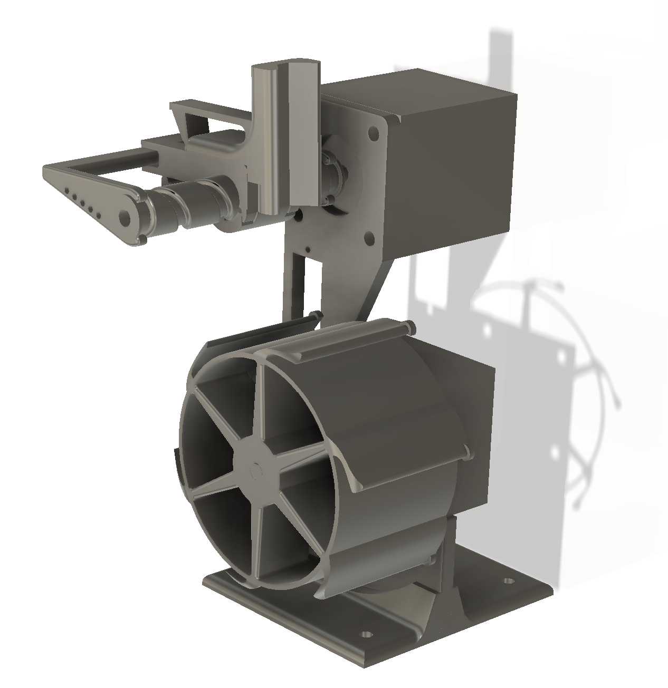

# Labeler CNC - ESP32 DevKit V1

Control CNC de dos drivers STEP/DIR y un servo RC basado en FluidNC 4.0.3.



Esta es una impresora/plotter de etiquetas de dos ejes: X arrastra la cinta, Y
desplaza el marcador transversalmente y un servo lo apoya o lo separa. Este
repositorio contiene el firmware, la configuración del ESP32 y la aplicación
web que genera y envía el G-code.

## Demostración

[](https://youtu.be/mnnyJeXbWnY)

Hacer clic en la imagen para ver el breve video de la máquina en funcionamiento.

El proyecto PlatformIO activo está en `firmware/FluidNC`. El sketch Arduino
experimental anterior fue retirado para evitar cargar accidentalmente un
firmware sin planificador CNC.

## Estructura

- `firmware/FluidNC`: código fuente fijado a FluidNC v4.0.3.
- `firmware/esp32-data/config.yaml`: configuración de los ejes X, Y y A.
- `hardware/printable`: piezas STL listas para preparar en el laminador.
- `github-pages`: assets HTML, CSS y JavaScript para GitHub Pages.

## Piezas imprimibles

Los modelos exportados para impresión 3D están en `hardware/printable`:

- [`carroYinferior.stl`](hardware/printable/carroYinferior.stl)
- [`carroYsuperior.stl`](hardware/printable/carroYsuperior.stl)
- [`portalapiz.stl`](hardware/printable/portalapiz.stl)
- [`ejeZ.stl`](hardware/printable/ejeZ.stl)
- [`ejeY.stl`](hardware/printable/ejeY.stl)
- [`pie.stl`](hardware/printable/pie.stl)
- [`soportegeneral.stl`](hardware/printable/soportegeneral.stl)
- [`soportemotor.stl`](hardware/printable/soportemotor.stl)
- [`carreteCinta.stl`](hardware/printable/carreteCinta.stl)

Los STL contienen solamente la geometría. Antes de imprimir, revisar en el
laminador la orientación, soportes, relleno y cantidad necesaria de cada pieza
según el material y la impresora disponibles.

La aplicación se publica automáticamente en
`https://diejfer.github.io/labeler`, busca `http://labeler.local` mediante las
APIs REST y no depende de archivos web almacenados en el ESP32.

El navegador debe soportar Local Network Access y conceder permiso a GitHub
Pages para buscar dispositivos en la red local. La implementación apunta a
Chrome/Edge 142 o posterior. El ESP32 y el navegador deben estar en la misma
red Wi-Fi con mDNS habilitado.

La fuente incluida deriva de Hershey Roman Simplex. Los glifos originales
fueron creados por el Dr. A. V. Hershey en el U.S. National Bureau of Standards
y el formato JHF distribuido fue creado por James Hurt, Cognition, Inc. La
licencia y los datos originales están en `github-pages/vendor/hershey`.

También se incluyen Playwrite DE SAS Guides, Orbitron y las cuatro variantes
de Lobster Two desde el repositorio oficial de Google Fonts, bajo SIL OFL 1.1.
Los Material Symbols Outlined y su catálogo de nombres provienen del repositorio
oficial de Google y se distribuyen bajo Apache 2.0. `opentype.js` se utiliza
bajo licencia MIT para transformar los contornos tipográficos en recorridos.
Todas las licencias están junto a sus assets en `github-pages/vendor`.

## Aplicación de etiquetas

La interfaz permite seleccionar cintas de 6, 9, 12, 18, 24, 36 o 45 mm, o ingresar
un ancho particular. Puede generar etiquetas de uno o dos renglones. El texto
se convierte en recorridos mediante Hershey Roman Simplex, una fuente vectorial
estándar de trazo simple para plotters, con mayúsculas y minúsculas. También
permite elegir fuentes OpenType de Google Fonts, cuyos contornos Bézier se
aproximan mediante segmentos de precisión mecánica. El editor permite ajustar
el interlineado y aplicar negrita, cursiva y subrayado tanto a la vista previa
como al G-code, además de buscar e insertar cualquiera de los Material Symbols
Outlined disponibles mediante tokens como `{home}`.

El eje X corresponde al sentido longitudinal de la cinta, Y a su ancho y el eje
A al servo que acerca o aleja el marcador. Antes de imprimir se muestra el
G-code completo para inspección.

Los siguientes datos sólo existen en la pestaña actual del navegador y nunca se
guardan en el ESP32:

- ancho seleccionado;
- formato de uno o dos renglones;
- interlineado y estilos de texto;
- textos de la etiqueta;
- programa G-code generado.

## API persistente

El firmware agrega estos endpoints a FluidNC:

```text
GET  /api/labeler/config
POST /api/labeler/config
```

La configuración se almacena en NVS bajo el espacio `labeler`. Incluye pasos
por milímetro, velocidades máximas, aceleraciones, velocidades de traslado e
impresión, margen, separación de caracteres, posiciones del servo y espera del
servo.

Al abrir una conexión, el cliente aplica la parametría persistente a los ejes X
e Y mediante los ajustes de ejecución de FluidNC. El archivo YAML y los valores
predeterminados de la aplicación usan la relación mecánica documentada debajo.

## Pines

La siguiente tabla es la fuente de verdad para el firmware incluido y coincide
con `firmware/esp32-data/config.yaml`:

| Función | ESP32 | Conectar a |
|---|---:|---|
| Pulso del motor X (arrastre de cinta) | GPIO27 | `STEP` del A4988 X |
| Sentido del motor X | GPIO26 | `DIR` del A4988 X |
| Habilitación del motor X | GPIO14 | `EN` del A4988 X |
| Pulso del motor Y (marcador) | GPIO33 | `STEP` del A4988 Y |
| Sentido del motor Y | GPIO32 | `DIR` del A4988 Y |
| Habilitación del motor Y | GPIO25 | `EN` del A4988 Y |
| Control del servo A | GPIO13 | Señal/PWM del servo |

### Conexionado de cada A4988

Además de STEP, DIR y EN, conectar cada módulo de esta forma:

| Pin del A4988 | Conexión |
|---|---|
| `VDD` | 3V3 del ESP32 |
| `GND` lógico | GND común |
| `VMOT` | Positivo de la fuente de los motores, dentro del rango admitido por el módulo |
| `GND` de potencia | Negativo de la fuente y GND común |
| `RESET` y `SLEEP` | Unir entre sí y llevar a 3V3 |
| `MS1`, `MS2` y `MS3` | 3V3 para seleccionar 1/16 de paso |
| `1A`, `1B` | Una bobina del motor |
| `2A`, `2B` | La otra bobina del motor |

Identificar primero las parejas de bobinas con un multímetro; los colores de
los cables no están estandarizados. Si un eje gira al revés, invertir una de
las bobinas con la alimentación apagada o invertir `direction_pin` en el YAML.
Colocar un capacitor electrolítico de al menos 100 µF entre `VMOT` y GND junto
a cada driver y ajustar el límite de corriente del A4988 antes de mover la
máquina.

El servo se conecta a GPIO13 (señal), a una fuente externa regulada de 5 V y a
GND común. No alimentar el servo desde 3V3 ni conectar VMOT al ESP32. El ESP32,
ambos A4988, la fuente de motores y la fuente del servo deben compartir GND.
No conectar ni desconectar motores o drivers mientras el equipo esté
energizado.

Los drivers X e Y se habilitan automáticamente al comenzar un movimiento y se
deshabilitan al volver a `Idle`, permitiendo mover ambos mecanismos a mano. El
servo permanece energizado para conservar el marcador en la posición alejada.

> **Importante:** los diagramas históricos de `hardware/` y la imagen de pinout
> `docs/esp32-devkit-v1-conexiones.png` corresponden a iteraciones anteriores y
> no coinciden con estos GPIO. Para construir esta versión, usar la tabla
> anterior y `firmware/esp32-data/config.yaml`.

## Calibración inicial

La configuración predeterminada presupone motores de 200 pasos completos por
vuelta (1,8° por paso) y los tres pines MS de cada A4988 en 3,3 V. Eso selecciona
1/16 de paso: `200 × 16 = 3200` pulsos STEP por vuelta. Los valores que trae el
firmware son:

| Eje | Transmisión | Pasos/mm | Pasos/cm |
|---|---|---:|---:|
| X | Rodillo de diámetro fijo 100 mm | 10,1859 | 101,859 |
| Y | Avance lineal de 15 mm por vuelta | 213,3333 | 2133,333 |

Los cálculos usados son `3200 / (π × 100)` para X y `3200 / 15` para Y. Al
conectarse, la aplicación aplica los valores persistentes de NVS sobre la
configuración activa de FluidNC. Para recalibrarlos con medidas reales:

```text
steps_per_mm = pasos_motor_por_vuelta * micropasos / avance_mm_por_vuelta
```

En esa fórmula, `micropasos` es 16 con el conexionado predeterminado. Por
ejemplo, si se cambia el A4988 a paso completo, también hay que recalibrar los
pasos/mm: no alcanza con mover los puentes MS1–MS3.

## Construcción y puesta en marcha

1. Montar la mecánica y comprobar que ambos ejes se muevan libres a mano.
2. Cablear el ESP32, los A4988 y el servo según las tablas anteriores, todavía
   sin insertar los drivers ni conectar los motores.
3. Verificar con un multímetro que no haya cortos y que VDD sea 3,3 V, la
   alimentación del servo sea 5 V y VMOT tenga la tensión prevista.
4. Cortar la alimentación, insertar los A4988 respetando su orientación,
   conectar los motores y ajustar el límite de corriente de cada driver.
5. Compilar y cargar firmware y filesystem como se indica en **Instalación**.
6. Conectar el ESP32 a Wi-Fi, abrir la aplicación publicada y probar primero
   movimientos de 0,1 mm desde **Configuración**.
7. Medir el desplazamiento real, corregir pasos/mm y recién entonces aumentar
   velocidad, aceleración y distancia de prueba.

La pestaña **Configuración** permite probar ambos ejes mediante desplazamientos
relativos de `0,1`, `1` y `10 mm` en los dos sentidos. La interfaz ya no expone
una consola ni una página de control manual.

Actualizar luego `max_rate_mm_per_min`, `acceleration_mm_per_sec2` y
`max_travel_mm` con valores reales de la máquina.

El servo es el eje A. FluidNC usa el rango interno A=-180..0 y la interfaz lo
traduce a 0..180 grados.

La configuración web permite indicar la holgura mecánica de X e Y en
milímetros. Cuando el generador detecta una inversión, agrega un movimiento
relativo exclusivo para tomar esa holgura y restaura la coordenada lógica con
`G92` antes de continuar el trazo. Un valor de `0` desactiva la compensación.

## Instalación

Desde `firmware/FluidNC`:

```powershell
platformio run -e wifi
platformio run -e wifi -t upload
```

Para construir y cargar el sistema de archivos con `config.yaml`:

```powershell
platformio run -e wifi -t buildfs
platformio run -e wifi -t uploadfs
```

También pueden cargarse ambos archivos desde el administrador web de FluidNC.
Reiniciar el controlador después de cargar `config.yaml`.

El filesystem también incluye la WebUI oficial de FluidNC. Si el ESP32 no
puede conectarse a la red configurada, crea el AP `FluidNC` (contraseña
`12345678`) en `http://192.168.4.1`. La página
`http://192.168.4.1/wifi.html` permite escanear redes y guardar un nuevo SSID
y contraseña sin usar USB. Conserva el modo `STA>AP` para mantener este portal
de recuperación cuando falle la conexión configurada.

Al arrancar por primera vez, FluidNC crea su punto de acceso. Para que los
assets externos funcionen, configurar el modo Station con las credenciales de
la red local desde la interfaz de FluidNC.

## Seguridad

La parada desde navegador no reemplaza una parada de emergencia cableada. Antes
de usar el sistema en una máquina real, agregar E-stop y finales de carrera a
pines dedicados y declararlos en `config.yaml`.
